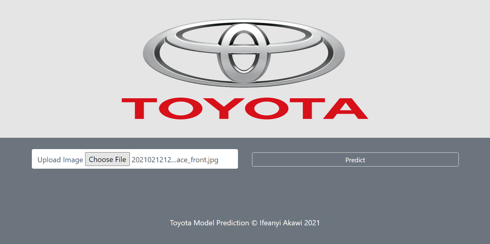
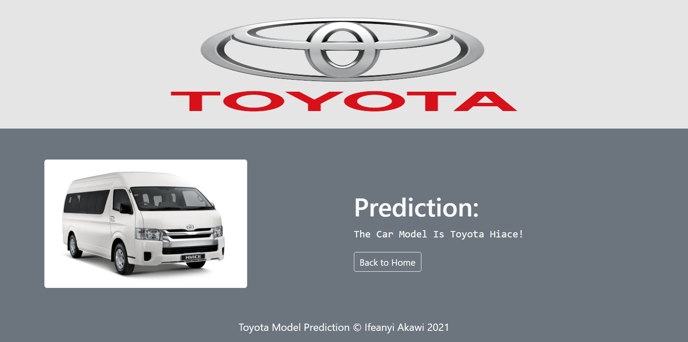

# [Toyota_Model_Recognizer](https://toyota-model-recognizer.herokuapp.com/)
This Web App uses [Visual Geometry Group (VGG19)](https://keras.io/api/applications/vgg/) model to build an API that predicts the model of toyota vehicles.

### Steps
The `scrape_car_images_using_selenium.ipynb` notebook was executed locally to scrape one thousand, one hundred (1100) images of toyota vehicles from google. The scrapper only scrapped for 10 vehicle classes, namely:
- `toyota_4runner`
- `toyota_avalon`
- `toyota_camry`
- `toyota_corolla`
- `toyota_fjcruiser`
- `toyota_hiace`
- `toyota_hilux`
- `toyota_landcruiser`
- `toyota_rav4`
- `toyota_sienna`

These classes were selected on the basis of brand model popularity within the Nigerian context. The selection followed no particular hierarchy. All selected vehicle classes had 110 images each in a class-separated folder. The folders were further split into `train` and `val` folders for training and validating the model. The `train` folder consists of 10 subfolders with `100` images each, while the `val` folder consists of 10 subfolders with `10` images each. 

Link to the dataset can be found [here](https://www.dropbox.com/sh/hz2zgnz6vt8vy2f/AADFGkkJ5a3uorQrN4SlxHQ0a?dl=0)

Splitting of the data into `train` and `val` was achieved using `split-folders` package. [see here](https://github.com/jfilter/split-folders)

### [ImageDataGenerator](https://keras.io/preprocessing/image/)
The `toyota_model_recognizer.ipynb` notebook was executed in google colab for efficeincy and speed. The images from the folders were loaded using the `ImageDataGenerator` library. This library helps to augment the training data **on the fly** by applying some transformations on the raw images to generate multiple views of the same image, thereby increasing the size of the dataset during training. This is popularly known as **`on the fly data augmentation`**. The generator also helps in rescaling the images.

### Model Training
A pre-trained VGG19 model was used to train the images. The top layer was removed to accomodate for a fully connected Dense Layer with `1024` neurons, a `relu` activation function, batchnormalization and dropout layers. `Softmax` activation function was applied at the output layer for multiclass classification (in this case 10 classes)

The model achieved 71% accuracy score at the end of 200 training epochs. Although this is not a very good score, but it's a significant improvement to the 50% accuracy score obtained when we used just `CNN` and trained for 300 epochs. The improved model will suffice considering the very small volume of data at the model's disposal.

### Model Compression
The size of the mode after training was 347mb. This large file size causes redundancies in deployment, as github does not permit pushing of files greater than 100mb.  
For this reason the model was compressed by following the steps outlined in [this official tensorflow doc](https://www.tensorflow.org/model_optimization/guide/pruning/pruning_with_keras) for optimization and quantization of models. This helped reduce the model size x10, to about 43mb, while maintaining the model's predictive accuracy.  
The `compress_model.ipynb` notebook shows the code for this. 

The compressed model is stored in the `model_dir` folder as `10x_tflite.tflite`.  
The fully trained VGG19 model together with the compressed model is found [here](https://drive.google.com/drive/folders/1ADfccMceNSsrVBJxOhUlA9e2plaa_Cmu?usp=sharing)

# Running the service...
- Click [here](https://toyota-model-recognizer.herokuapp.com/) to run a prediction  
- Click on `Choose File` to select an image
- Select a toyota image from your local machine
- Click on the `Predict` button to the right
- Wait for approximate 1 (one) minute for the system to preprocess and predict image.
- Viola!!! Here you have prediction.

# Snapshot of Web App  
#### (The home page)  
  

#### The prediction Page
  

# Further Steps
- [ ] Create a more sophisticated web interface
- [ ] scrape more image dataset to create an even better model
- [x] Train model using Transfer learning and compare performance 
- [ ] Include more classes
